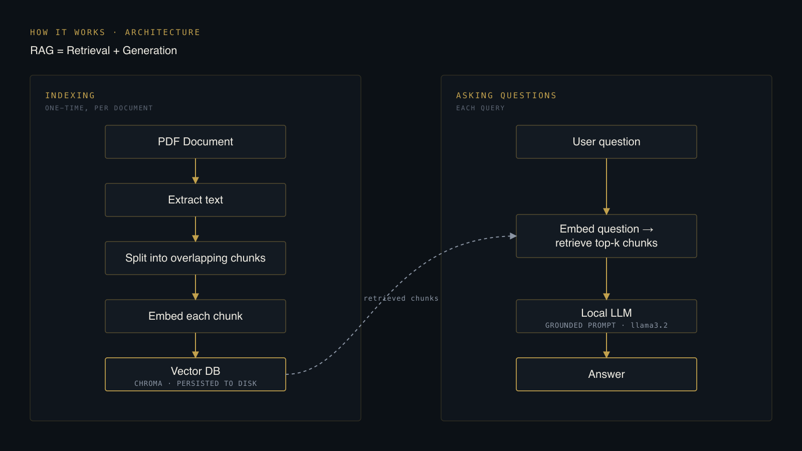

# How RAG Actually Works — Building a Fully-Local PDF Chatbot

## TL;DR

I built a chatbot that answers questions about any PDF, running **100%
offline**. No OpenAI key, no per-token bill, no document ever leaving the
machine. Ollama runs the language model, sentence-transformers does the
embeddings, and Chroma stores the vectors — all locally.

That part is a weekend project. The interesting part is *why it works*, and
the handful of places it silently doesn't. This article walks the whole
retrieval-augmented-generation (RAG) pipeline one stage at a time, using the
real code, and pins a specific failure mode to each stage — the stuff a slide
deck skips.

If you just want the shape of it: a PDF is chopped into overlapping chunks,
each chunk is turned into a vector that captures its *meaning*, and those
vectors are stored once. At question time, your question becomes a vector too,
the closest chunks are pulled back, and a local LLM answers **using only those
chunks**. Retrieval finds the facts; generation phrases them.

---

## The mental model: why "retrieval + generation"

A language model on its own has two problems for this job. It has never seen
your PDF, so it can't answer from it — and when it doesn't know, it tends to
make something plausible up. Plain search has the opposite problem: it can
find the right paragraph, but it hands you a paragraph, not an answer.

RAG staples the two together and each covers the other's weakness:

- **Retrieval** grounds the model in *your* document — it can only talk about
  text that was actually pulled back.
- **Generation** turns those raw passages into a fluent, direct answer to the
  exact question you asked.

The whole system is built around one instruction to the model: *use only the
context I give you; if it isn't there, say you don't know.* Everything
upstream exists to make sure the right context lands in that prompt.

---

## Architecture at a glance

There are two separate loops, and keeping them separate is the first thing
worth understanding. **Indexing happens once per document. Answering happens
once per question.**



Indexing is the expensive part — read the PDF, split it, run every chunk
through an embedding model, write it all to disk. You pay that cost one time.
Every question after that only touches the cheap right-hand loop: embed one
short question, grab a few chunks, ask the model. The persisted vector DB is
what makes the difference between a snappy chatbot and one that re-reads your
whole PDF on every message.

---

## Stage by stage — and where each one breaks

### 1. Load — the loader you pick decides whether anything works

```python
from langchain_community.document_loaders import PyMuPDFLoader

pages = PyMuPDFLoader(str(pdf_path)).load()   # one Document per page
```

This looks like a throwaway line. It is the single most common way to get a
chatbot that answers *"I don't know"* to **everything**.

Many PDFs — Google Docs exports are the classic offender — don't store text as
words. They store glyphs at x/y positions and leave out the space characters
entirely. A naive loader (`PyPDFLoader`, built on pypdf) reads those glyphs in
order and gives you `TABLEOFCONTENTS` instead of `TABLE OF CONTENTS`. That
word-smashed text then poisons everything downstream: the embeddings are
garbage, so retrieval misses, and even when a chunk does come back the model
can't read it.

`PyMuPDFLoader` reconstructs spaces from the glyph geometry, so the text comes
out as actual words. If your PDF has a clean text layer either loader is fine;
when in doubt, use PyMuPDF.

> **Failure mode:** bad text layer → word-smashed chunks → the bot knows
> nothing. It *looks* like an LLM problem and is actually a loader problem.

### 2. Split — chunking, and the chars-vs-tokens trap

```python
from langchain_text_splitters import RecursiveCharacterTextSplitter

splitter = RecursiveCharacterTextSplitter(
    chunk_size=1000,      # characters per chunk
    chunk_overlap=200,    # characters shared between neighbours
)
chunks = splitter.split_documents(pages)
```

You can't embed a whole PDF as one vector — you'd lose all locality, and
retrieval could never point at a specific passage. So the document is cut into
chunks, and two numbers govern how.

`chunk_size` is how big each piece is. Smaller chunks (~500) retrieve more
precisely but produce more pieces and more noise; larger chunks (~1500) carry
more context but risk overflowing the model's context window. 1000 is a good
default for prose.

Here's the trap: **`chunk_size` counts characters, not tokens.** For typical
English, ~4 characters ≈ 1 token, so:

- `chunk_size = 1000` ≈ **250 tokens** per chunk
- `k = 6` chunks retrieved ≈ **~1,500 tokens** of context sent to the model

That's the number you actually need to keep under the model's context limit.
If you want token-accurate sizing, pass a token-based length function (e.g.
tiktoken) instead of the character-count default.

`chunk_overlap` repeats a little text between neighbouring chunks so a sentence
that straddles a boundary isn't sliced clean in half — the idea survives in at
least one chunk. 200 (~20% of chunk size) is a safe default; raise it for
dense technical text.

> **Failure mode:** chunks too large → fewer, noisier matches and context
> overflow; too small → the answer gets split across chunks and no single one
> retrieves well.

### 3. Embed — turning text into meaning

```python
from langchain_huggingface import HuggingFaceEmbeddings

embeddings = HuggingFaceEmbeddings(model_name="all-MiniLM-L6-v2")
```

An embedding model maps a piece of text to a vector — here, 384 numbers —
positioned so that text with *similar meaning* lands nearby. "How do I fire
someone?" and "employee termination process" end up close together even though
they share no words. That semantic closeness is the whole reason retrieval can
find relevant chunks instead of doing keyword matching.

`all-MiniLM-L6-v2` is small (384-dim) and fast, which is why it's the default.
Bigger models like `all-mpnet-base-v2` retrieve better on long or technical
documents, at the cost of speed.

One rule matters more than model choice: **the query must be embedded with the
same model as the chunks.** Change the embedding model without re-indexing and
the question vectors live in a different space than the stored ones —
retrieval silently returns nonsense, no error thrown.

> **Failure mode:** mismatched embedding models between index time and query
> time. No crash, just quietly wrong results.

### 4. Store — index once, reuse forever

```python
from langchain_chroma import Chroma

Chroma.from_documents(
    documents=chunks,
    embedding=embeddings,
    persist_directory="./pdf_db",   # written to disk
)
```

Chroma writes the vectors (and the original chunk text) to `./pdf_db`. This is
the payoff of separating the two loops: run this once, and every future chat
session reconnects to the same DB instead of re-embedding the PDF.

> **Failure mode:** rebuilding the DB on every run. Not wrong, just slow — and
> a sign the persist/reuse split wasn't wired up.

### 5. Retrieve — top-k, and how to see what it's doing

```python
retriever = vectorstore.as_retriever(search_kwargs={"k": 6})
```

At question time the retriever embeds the question and returns the `k` nearest
chunks. `k` is a balance: too low and you miss the chunk with the answer; too
high and you pad the prompt with irrelevant text that distracts the model.

The reason retrieval is worth this much attention is that it's the stage you
can't see — until you look. A small read-only script makes it visible:

```python
# inspect_db.py — read-only look inside ./pdf_db
results = db.similarity_search_with_score(query, k=5)
for doc, score in results:
    page = (doc.metadata or {}).get("page", "?")
    print(f"score={score:.4f}  p{page}")
    print(f"    {clean(doc.page_content)}")
```

Now you can ask a question and *watch which chunks come back and how close
they scored* (lower = closer). This is the single most useful debugging tool
in the whole project — more on that below.

> **Failure mode:** wrong `k`, or a good answer that simply isn't in any
> retrieved chunk. Broad questions like *"summarize this document"* fail here
> by design — no single chunk states the whole-document topic, so top-k has
> nothing to grab.

### 6. Generate — grounding the model, and letting it say "I don't know"

```python
SYSTEM_PROMPT = (
    "You are a helpful assistant answering questions about a PDF document. "
    "Use ONLY the context below to answer. If the context does not contain "
    "the answer, say you don't know — do not make anything up.\n\n"
    "Context:\n{context}"
)

llm = ChatOllama(model="llama3.2", temperature=0.3)
```

The retrieved chunks get stuffed into `{context}` and the model is told, in no
uncertain terms, to answer from that and nothing else. `temperature=0.3` keeps
it grounded and literal rather than creative — you want it reporting the
document, not riffing on it.

There's also a guard before the model is even called: if retrieval returns
nothing, don't bother the LLM at all.

```python
docs = retriever.invoke(question)
if not docs:
    print("Bot:", NO_CONTEXT_MSG, "\n")   # "couldn't find anything relevant..."
    continue
```

The counterintuitive part: **a good RAG bot says "I don't know" on purpose.**
When the answer genuinely isn't in the PDF, an honest "I don't know" beats a
confident fabrication. That refusal is a feature of the grounding prompt, not
a bug.

> **Failure mode:** temperature too high, or a weak grounding prompt → the
> model starts answering from its own training instead of your document, and
> the answers drift away from the source.

---

## Debugging as a decision tree

Once you've built a few of these, almost every "the answers are bad" report
resolves the same way. The trick is that `inspect_db.py` splits the problem
cleanly in two. Run your failing question through it and look at the chunks
that come back:

| What you see | Diagnosis | Where to fix |
|---|---|---|
| Right chunks don't surface (or scores are high, ~1.4+) | **Retrieval problem** | Tune `k`, chunk size/overlap, or the embedding model — then re-index |
| Right chunks *do* surface, but the answer is still wrong | **LLM / prompt problem** | Tighten the grounding prompt, lower temperature, or try a stronger model |
| Chunks are word-smashed gibberish | **Loader problem** | Re-ingest with `PyMuPDFLoader` |
| Nothing relevant exists for the question | **Working as intended** | Ask a more specific, document-anchored question |

The point is that "the chatbot is wrong" is never one bug. It's at least three
different bugs living at three different pipeline stages, and the similarity
scores tell you which one you have before you change a single line.

---

## The knobs, and how to turn them

Everything tunable in one place, with the reasoning:

| Knob | Default | Turn it when |
|---|---|---|
| **LLM model** | `llama3.2` | Swap to `mistral` for a different speed/quality trade; larger models for harder reasoning |
| **Embedding model** | `all-MiniLM-L6-v2` (384-dim) | Move to `all-mpnet-base-v2` for long/technical docs — better retrieval, slower |
| **chunk_size** | 1000 chars (~250 tokens) | Smaller for tabular/technical PDFs so rows aren't split; larger for flowing prose |
| **chunk_overlap** | 200 chars | Raise for dense/technical text; lower for short simple docs |
| **top-k** | 6 | Lower if the prompt feels noisy; raise if the answer's chunk is being missed |
| **temperature** | 0.3 | Keep low for grounded Q&A; raise only if you want more phrasing freedom |

Any change to `chunk_size`, `chunk_overlap`, or the embedding model means
**re-indexing** — those decisions are baked into the stored vectors.

---

## Limitations, and when local RAG is the right call

Running everything locally buys real things: the document never leaves your
machine, there are no API costs or rate limits, and it works on any PDF. That
makes it a genuinely good fit for private contracts, internal policies,
personal knowledge bases, research papers — anything you'd rather not upload.

It also has honest limits:

- Answer quality is capped by the local model you can run.
- First-time indexing of very large PDFs is slow.
- Complex tables and images need extra handling beyond plain text extraction.
- It wants decent hardware (8GB+ RAM is comfortable).

If you need frontier-model reasoning or you're indexing millions of documents,
a hosted setup makes more sense. For "answer questions about *this* document,
privately, for free," local RAG is hard to beat.

**Future directions:** multiple PDFs / whole folders, conversation memory so
follow-up questions keep context, a Streamlit or Gradio web UI, and packaging
the whole thing as a desktop app.

---

## What this project demonstrates

The chatbot is small on purpose. What it shows is the thing that actually
matters in applied LLM work: RAG isn't one black box, it's a **pipeline of six
legible stages**, and being effective with it means knowing which stage a
given failure lives in — and having a cheap way to prove it. The
similarity-score inspector is a hundred lines and it's worth more than any
amount of prompt-tweaking, because it turns "the bot is dumb" into a specific,
locatable bug.

Full source: `ingest.py` (load → split → embed → persist), `chat.py`
(retrieve → ground → answer), and `inspect_db.py` (the diagnostic lens).
